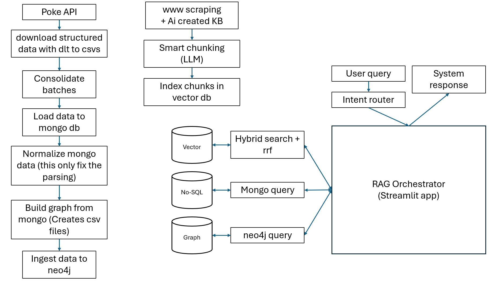

# 🧬 Pokémon RAG System — Multi-Source Knowledge Assistant (v1.0)

## 📘 Overview

This project implements a **Retrieval-Augmented Generation (RAG)** system that fuses **semantic**, **factual**, and **relational** knowledge to answer Pokémon-related questions with factual precision and contextual reasoning.

The architecture integrates:

- 🧠 **LLM Orchestrator** – intent routing & answer synthesis  
- 🧩 **Qdrant** – vector search with hybrid RRF ranking  
- 📄 **MongoDB** – factual Pokémon data (species, moves, stats, abilities)  
- 🕸 **Neo4j** – graph reasoning (evolutions, type relations, ability networks)  
- 💬 **Streamlit** – unified interface for chat & debugging  

---

## 🧠 System Architecture

```

User Query
↓
Intent Router (LLM)
↓
──────────────────────────────
│ Parallel Retrieval Phase    │
│ ├─ Qdrant (vector)          │ → semantic context
│ ├─ MongoDB (No-SQL)         │ → factual data
│ └─ Neo4j (graph)            │ → relational reasoning
──────────────────────────────
↓
Fusion & Answer Generation (LLM)
↓
Streamlit RAG Orchestrator → Response

```



The system performs **multi-source retrieval in parallel**, merges all contexts, and lets the LLM generate a unified, explainable answer.

---

## ⚙️ Core Pipeline

### 1️⃣ Ingestion & Consolidation  
Scripts under `src/`:
- `ingest_pokeapi_dlt_structured.py` → downloads structured data from **PokéAPI** using DLT  
- `consolidate_pokedex_batches.py` → merges CSVs into a unified dataset  
- `load_to_mongo.py` → loads data into **MongoDB**

### 2️⃣ Normalization  
- `normalize_mongo_data.py` → fixes JSON structure and parsing inconsistencies  

### 3️⃣ Graph Construction  
- `build_graph_from_mongo.py` → builds CSV nodes/edges  
- `load_to_neo4j.py` → ingests the Pokémon graph into **Neo4j**

Relationships modeled:
```

(:Pokemon)-[:HAS_TYPE]->(:Type)
(:Pokemon)-[:EVOLVES_TO]->(:Pokemon)
(:Type)-[:STRONG_AGAINST|WEAK_AGAINST]->(:Type)
(:Pokemon)-[:HAS_ABILITY]->(:Ability)

```

### 4️⃣ Semantic Knowledge Base  
- `simple_scraper.py` → extracts Pokémon guides and mechanics  
- `smart_chunking.py` → performs **LLM-based semantic chunking & summarization**  
- `hybrid_index_qdrant.py` → embeds & indexes chunks in **Qdrant**  

### 5️⃣ Multi-Source Retrieval  
- `hybrid_search_qdrant.py` → hybrid semantic search (RRF between dense + BM25)  
- `mongo_query.py` → factual attribute queries  
- `graph_query.py` → relationship queries  

### 6️⃣ Fusion & Orchestration  
- `intent_router.py` → extracts entities and intents from queries  
- `generate_answer.py` → merges multi-DB results and generates grounded answers  
- `app_streamlit.py` → orchestrator UI with **Chat** and **Debug** modes  

---

## 🧰 Environment Setup

### Prerequisites
- Python ≥ 3.10  
- [uv](https://docs.astral.sh/uv/) (package & environment manager)  
- OpenAI API key  
- Docker (for running the databases defined in the repo)

### Installation

```bash
git clone https://github.com/Maxkaizo/g_poke_t.git
cd g_poke_t
uv sync
````

### Environment Variables

Create a `.env` file from the example provided:

```bash
cp .env_example .env
```

Then edit with your credentials:

```bash
OPENAI_API_KEY=sk-xxxx
QDRANT_URL=http://localhost:6333
QDRANT_API_KEY=pokedex-key
QDRANT_COLLECTION=pokedex_hybrid
MONGO_URI=mongodb://localhost:27017
NEO4J_URI=bolt://localhost:7687
NEO4J_USER=neo4j
NEO4J_PASSWORD=yourpassword
```

---

## 🚀 Run the Full System

### 1️⃣ Set up

```bash
docker compose up -d
make setup
```
or

```bash
docker compose up -d
uv run python src/ingest_pokeapi_dlt_structured.py
uv run python src/consolidate_pokedex_batches.py
uv run python src/load_to_mongo.py
uv run python src/normalize_mongo_data.py
uv run python src/build_graph_from_mongo.py
uv run python src/load_to_neo4j.py
uv run python src/smart_chunking.py
uv run python src/hybrid_index_qdrant.py
```

### 2️⃣ Launch the RAG Orchestrator

```bash
make run
```
or

```bash
uv run streamlit run src/app_streamlit.py
```

Then open: [http://localhost:8501](http://localhost:8501)

---

## 🧭 Example Query Flow

| Step                                                          | Component                                            | Output |
| ------------------------------------------------------------- | ---------------------------------------------------- | ------ |
| User asks: “How does Eevee evolve and what type is Vaporeon?” | —                                                    | —      |
| Intent Router                                                 | Extracts entities → `Eevee`, `Vaporeon`              |        |
| Qdrant                                                        | Returns semantic context about evolution mechanics   |        |
| MongoDB                                                       | Returns factual Pokémon data (species, type, stats)  |        |
| Neo4j                                                         | Finds relation `(:Eevee)-[:EVOLVES_TO]->(:Vaporeon)` |        |
| LLM Fusion                                                    | Combines all retrieved info                          |        |
| Streamlit                                                     | Displays reasoning + grounded answer                 |        |

---

## 📊 Evaluation (Work in Progress)

The upcoming evaluation module (`evaluate_rag.py`) will assess:

| Metric                         | Purpose                                   |
| ------------------------------ | ----------------------------------------- |
| **HR@k (Hit Rate)**            | Check if correct context appears in top-k |
| **MRR (Mean Reciprocal Rank)** | Evaluate retrieval ranking                |
| **Faithfulness Score**         | Check factual grounding of LLM answers    |
| **Response Coherence**         | Evaluate semantic consistency             |

Comparison modes:

* Qdrant-only
* Neo4j-only
* Hybrid (RRF fusion)

---

## ✅ Current Status

| Module            | Status | Notes                       |
| ----------------- | ------ | --------------------------- |
| PokéAPI ingestion | ✅      | Automated via DLT           |
| MongoDB           | ✅      | Normalized factual data     |
| Neo4j             | ✅      | Graph model fully loaded    |
| Qdrant            | ✅      | Hybrid semantic index       |
| Intent router     | ✅      | LLM-based entity extraction |
| Streamlit app     | ✅      | Chat + debug modes          |
| Evaluation        | 🟡     | Framework pending           |

---

## 🧩 Summary

> The **Pokémon RAG System** is a fully reproducible, multi-source retrieval pipeline that merges **symbolic reasoning (Neo4j)**, **factual data (MongoDB)**, and **semantic understanding (Qdrant)** into a single LLM-driven assistant.

**Core principle:**

> *Graph reasoning explains “what” and “how”; semantic retrieval explains “why.”*

---

## 🧱 Next Milestones

* [ ] Add evaluation scripts & dashboard
* [ ] Improve embedding quality (contrastive fine-tuning)
* [ ] Integrate caching + conversation memory
* [ ] Deploy cloud-ready container build

---

**Author:** [Maxkaizo](https://github.com/Maxkaizo)
**Course:** DataTalksClub — LLM Zoomcamp 2025
**Version:** `v1.0 – Fully Integrated Multi-Source RAG`

```
